# XDMA Tutorial

Tutorial for an [XDMA](https://docs.xilinx.com/r/en-US/pg195-pcie-dma/Introduction)-based peripheral FPGA design using [reworked XDMA driver](https://github.com/Prandr/dma_ip_drivers) that was adapted and extended from the [Tutorial for the original driver by mwrnd](https://github.com/mwrnd/notes/tree/main/XDMA_Communication).

This tutorial can't replace PG195 linked above. It is rather meant to supplement it on host programming. Therefore, it is advisable to study PG195 first for better understanding of underlying operation.


## Table of Contents
   
   * [Software Access to AXI Stream Blocks](#software-access-to-axi-stream-blocks)
   * [Software Access to Memory-Mapped Blocks](#software-access-to-memory-mapped-blocks)
      * [M_AXI](#m_axi)
      * [M_AXI_LITE](#m_axi_lite)
      * [M_AXI_BYPASS](#m_axi_bypass)
   * [`ioctl` Operations on DMA Devices](#ioctl-operations-on-dma-devices)
      * [DMA Transfers with `ioctl`](#dma-transfers-with-ioctl)
      * [Testing Performance](#testing-performance)
      * [Other Operations](#other-operations)
   * [Creating an AXI4-Stream XDMA Block Diagram Design](#creating-an-axi4-stream-xdma-block-diagram-design)
   * [Creating a Memory-Mapped XDMA Block Diagram Design](#creating-a-memory-mapped-xdma-block-diagram-design)
   * [Porting the Design to Another FPGA](#porting-the-design-to-another-fpga)
   * [Install XDMA Driver from dma_ip_drivers](#install-xdma-driver-from-dma_ip_drivers)
   * [Useful Links](#useful-links)


## Overview

PCI Express is a [Layered Protocol](https://en.wikipedia.org/wiki/Protocol_stack). With the [XDMA Driver (*dma_ip_drivers*)](https://github.com/xilinx/dma_ip_drivers) running on the host PC and an [XDMA IP Block](https://docs.xilinx.com/r/en-US/pg195-pcie-dma/Introduction) in your FPGA project, you operate at the Application layer. You read from and write to what appears as a file but it accesses the AXI Bus in your FPGA project. The XDMA Driver and XDMA IP Block handle the lower layers.

The XDMA driver creates [character device files](https://en.wikipedia.org/wiki/Device_file#Character_devices) for easy access to all enabled interfaces.  By default, the write-only device for DMA transfers to DMA interface is named `/dev/xdma0_h2c_0`,  while the read-only `/dev/xdma0_c2h_0` serves the DMA transfers in the opposite direction. This is the case for both AXI-Stream (**M_AXIS_H2C**/**S_AXIS_C2H**) and full memory mapped AXI (**M_AXI**) varieties. The driver enforces appropriate access restrictions. Moreover, the driver permits only one thread at a time to perform transfers on a DMA device. Use separate DMA channels, if you require simultaneous access.

Intended for single word (32-Bit) register-like reads and writes to **M_AXI_LITE** interface, `/dev/xdma0_user` is Read-Write. **M_AXI_BYPASS** interface `/dev/xdma0_bypass` could be [useful for small transfers that require low and stable latency](https://github.com/Prandr/dma_ip_drivers/blob/reworked_xdma_main/XDMA/linux-kernel/docs/bypass_bar.md).

The driver allows to adjust the names of character devices with compile options for better overview and to reflect application. It is highly recommended to run `make help` to learn about these and many other configuration options for the driver.

All interfaces are accessed with `write`, `read`, `lseek`, `pwrite`, `pread` system calls as appropriate. See following sections for specifics for each device.  C Library functions from `stdio.h` like `fread` should be avoided, as they can cause undesireable side effects. Note that the Linux kernel limits file operations to ~2 GB. The driver provides a way to circumvent this limitation for DMA devices by allowing to [submit the DMA transfer requests over `ioctl` system call](#dma-transfers-with-ioctl).

XDMA IP Core manages DMA transfers on descriptor level. The practical reprecussion of this is that the transfer progress is reported in terms of the number completed descriptors. The driver tries to make the best of it in the case of a partial transfers (because of a timeout or a caught signal) by returning the amount of data in the completed descriptors, which would be very likely less, than the actual transferred amount. There is unfortunately no way to find out the latter, unless the application has a way to differentiate meaningful data. If not, the data transferred beyond reported amount is effectively lost and the FPGA logic might require a reset to bring it into a known state. Therefore, it is _strongly recommended not to rely on timeouts_ in normal operation and treat them as an error state.

## Software Access to AXI Stream Blocks

**AXI4-Stream** is designed for continuous throughput. 
To send data to an M\_AXIS\_H2C\_? port you should use `write` system call to write to the corresponding device file. 
To retrieve data from an S\_AXIS\_C2H\_? port you should use `read` system call to read from the corresponding device file. 

In some applications FPGA logic expects `tlast` line to signal the end of a H2C transmission. The driver has optional support for this behaviour, which can be enabled by adding the `O_TRUNC` flag to the `open` call.

Multiples of the `tdata` width (64-Bits for this demo) up to the [Stream](https://docs.xilinx.com/r/en-US/pg085-axi4stream-infrastructure/AXI4-Stream-Data-FIFO?tocId=gyNUSa81sSudIrD3MNZ6aw) [FIFO](https://en.wikipedia.org/wiki/FIFO_(computing_and_electronics)) depth need to be read from C2H (Card-to-Host) or written to H2C (Host-to-Card).


See [Creating an AXI4-Stream XDMA Block Diagram Design](#creating-an-axi4-stream-xdma-block-diagram-design) below for instructions to recreate the simple included demo. It can also be [retargeted to other FPGAs and/or boards](#porting-the-design-to-another-fpga).

Each pair of input (H2C) floating-point values is multiplied to an output (C2H) floating-point value. To account for FIFOs built into the AXI4-Stream blocks, 16 floats (64-bytes) are sent and 8 are received. The data stream sinks into **S_AXIS_C2H_?** and flows from **M_AXIS_H2C_?** interface ports.


```C
#include <unistd.h>

ssize_t write(int fd, const void *buf, size_t count);
ssize_t read(int fd, const void *buf, size_t count);
```

Linux kernel truncates the `count` parameter of these functions to ~2 GB. The driver provides a way to circumvent this limitation by allowing to [submit the DMA transfer requests over `ioctl` system call](#dma-transfers-with-ioctl).

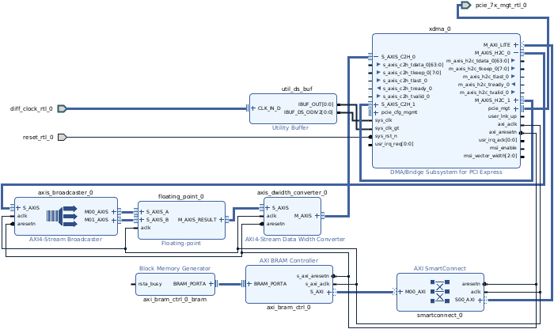


```C
#define DATA_SIZE 64
#define H2C_FLOAT_COUNT (DATA_SIZE / 4)
#define C2H_FLOAT_COUNT (H2C_FLOAT_COUNT / 2)

float h2c_data[H2C_FLOAT_COUNT];
float c2h_data[C2H_FLOAT_COUNT];
ssize_t rc = 0;

int xdma_fd_wrte = open("/dev/xdma0_h2c_0", O_WRONLY);
int xdma_fd_read = open("/dev/xdma0_c2h_0", O_RDONLY);

printf("H2C_FLOAT_COUNT = %d, C2H_FLOAT_COUNT = %d\n",
        H2C_FLOAT_COUNT, C2H_FLOAT_COUNT);

// fill the write data buffer with floating point values
for (int i = 0; i < H2C_FLOAT_COUNT; i++) { h2c_data[i]=(3.14*(i+1)); }


// write data buffer to the AXI Stream
rc = write(xdma_fd_wrte, h2c_data, (H2C_FLOAT_COUNT * sizeof(float)));
printf("Write returned rc = %ld = number of bytes sent\n", rc);

// read data from the AXI Stream into buffer
rc = read(xdma_fd_read, c2h_data, (C2H_FLOAT_COUNT * sizeof(float)));
printf("Read  returned rc = %ld = number of bytes received\n", rc);


// print the data in the return data (C2H) buffer
uint32_t j = 0;
float expected = 0;
printf("\n");
for (int i = 0 ; i < H2C_FLOAT_COUNT; i=i+2)
{
    j = floor((i / 2));
    printf("%-2d, %-2d, h2c[%02d]*[%02d]=c2h[%02d] = %f*%f = %f",
            i, j, i, (i+1), j, h2c_data[i], h2c_data[(i+1)], c2h_data[j]);
    if (fabs((h2c_data[i] * h2c_data[(i+1)]) - c2h_data[j]) > 0.01)
    {
        expected = (h2c_data[i] * h2c_data[(i+1)]);
        printf(" -- ERROR, was expecting %f", expected);
    }
    printf("\n");
}

close(xdma_fd_wrte);
close(xdma_fd_read);
```

[`stream_test.c`](stream_test.c) contains the above in a full C program.
```
gcc -Wall stream_test.c -o stream_test -lm
sudo ./stream_test
```

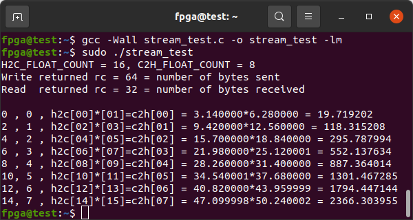


## Software Access to Memory-Mapped Blocks

See [Creating a Memory-Mapped XDMA Block Diagram Design](#creating-a-memory-mapped-xdma-block-diagram-design) below for instructions to recreate the simple included demo. It can also be [retargeted to other FPGAs and/or boards](#porting-the-design-to-another-fpga).

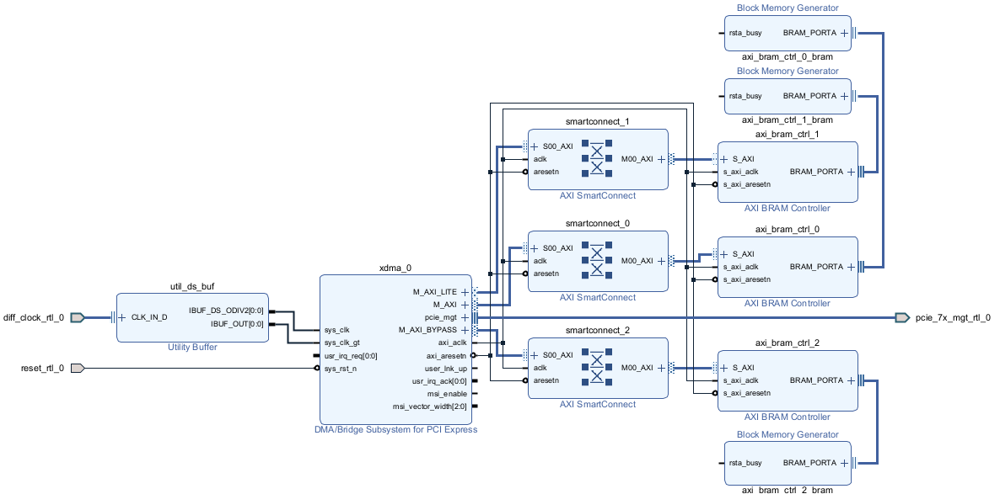

To download data from a memory mapped AXI interface at address `0x12345000` you would read from address `0x12345000` of the `/dev/xdma0_c2h_0` (Card-to-Host) file. To upload data you would write to the appropriate address of the `/dev/xdma0_h2c_0` (Host-to-Card) file.

This can be accomplished in 2 ways:

1. Set address with [`lseek`](https://man7.org/linux/man-pages/man2/lseek.2.html), then use `read` or `write`. `offset` argument in combination with `SEEK_SET` as `whence` argument directly corresponds to the address. `lseek` comes with additional flexibility with `SEEK_CUR` and `SEEK_END` `whence` options, that allows to set the endpoint address relative respectively to current value or the end of the address space. This could be useful in some cases.
    
    ```C
    #include <unistd.h>

    off_t lseek(int fd, off_t offset, int whence);
    ssize_t write(int fd, const void *buf, size_t count);
    ssize_t read(int fd, const void *buf, size_t count);
    ```
2. `pread` and `pwrite` allow to access the address (`offset` argument) directly. 
    ```C
    #include <unistd.h>
    
    ssize_t pread(int fd, void *buf, size_t count, off_t offset);
    ssize_t pwrite(int fd, const void *buf, size_t count, off_t offset);
    ```

With both ways Linux kernel truncates the `count` parameter of the functions to ~2 GB. The driver provides a way to circumvent this limitation by allowing to [submit the DMA transfer requests over `ioctl` system call](#dma-transfers-with-ioctl).

The 2 methods are not exactly equivalent. `write` and `read` advance address by `count` after performing successful operation. Thus repeated call would access that address:

```C
#define READ_SIZE 1024
lseek(fd, 0x40001000, SEEK_SET); //set address to 0x40001000
read(fd, read_buf, READ_SIZE); //perform the read operation. Advances the address by 1024/0x400.
read(fd, read_buf, READ_SIZE); //perform the read operation from address 0x40001400, in turn advances the address by 1024/0x400.
lseek(fd, -READ_SIZE, SEEK_CUR); // reset the address to the start address of tha last operation (0x40001400)
```
This may be handy for accessing of consecutive address ranges, as it makes it unneccessary to track address and to repeatedly call `lseek`.

`pwrite` and `pread` leave the address untouched. They may be more convienient for accesses to non-consecutive address ranges as well as repeated accesses to the same address.

Note that the Linux kernel limits file operations to ~2 GB. The driver provides a way to circumvent this limitation for DMA devices by allowing to [submit the DMA transfer requests over `ioctl` system call](#dma-transfers-with-ioctl).

### M_AXI

The **M_AXI** interface is for Direct Memory Access (DMA) to AXI blocks.

Adding `O_TRUNC` flag to the `open` call can be used to optionally enable the "fixed address mode", also called "non-incremental mode" by PG195. In this mode all data is written to or read from the specified (start) address. This may be helpful, when communicating with FIFO-like blocks, e. g. writing to certain address places data onto processing queue. The mode can be also modified [with `ioctl`](#other-operations) without reopening the device file.


The [BRAM Controller Block](https://docs.xilinx.com/v/u/en-US/pg078-axi-bram-ctrl) attached to the interface has an address of `0xC0000000` and a size of 8KB (smallest that will consistently work). You can increase the *Size*/*Range* up to the maximum that Vivado will successfully implement based on your FPGA's resources.


The following is some minimal C code without error checking. Observe the `buffer` is defined as an array of [32-Bit unsigned integers (`uint32_t`)](https://manpages.ubuntu.com/manpages/trusty/en/man7/stdint.h.7posix.html) and is used as such but `pread`/`pwrite` operate on bytes, hence the `#define`s for `DATA_BYTES` and `DATA_WORDS`. `/dev/xdma0_h2c_0` (Host-to-Card) is opened as Write-Only ([`O_WRONLY`](https://manpages.ubuntu.com/manpages/trusty/en/man2/open.2.html)). `/dev/xdma0_c2h_0` (Card-to-Host) is opened as Read-Only ([`O_RDONLY`](https://manpages.ubuntu.com/manpages/trusty/en/man2/open.2.html)).
```C
#define DATA_BYTES    8192
#define DATA_WORDS    (DATA_BYTES/sizeof(uint32_t))

uint32_t write_buffer[DATA_WORDS]={};
uint32_t read_buffer[DATA_WORDS]={};
uint64_t address = 0xC0000000;
int xdma_h2cfd = 0;
int xdma_c2hfd = 0;
ssize_t rc;

// Fill the write_buffer with data
for (int i = 0; i < DATA_WORDS; i++) { write_buffer[i] = (DATA_WORDS - i); }

printf("Buffer Contents before H2C write: \n");
printf("[0]=%04d, [4]=%04d, [%ld]=%04d\n",
	(uint32_t)write_buffer[0], (uint32_t)write_buffer[4],
	(DATA_WORDS - 3), (uint32_t)write_buffer[(DATA_WORDS - 3)]);

// Open M_AXI H2C Host-to-Card Device as Write-Only
xdma_h2cfd = open("/dev/xdma0_h2c_0", O_WRONLY);

// Write the full write_buffer to the FPGA design's BRAM
rc = pwrite(xdma_h2cfd, write_buffer, DATA_BYTES, address);


// Open M_AXI C2H Card-to-Host Device as Read-Only
xdma_c2hfd = open("/dev/xdma0_c2h_0", O_RDONLY);

// Read the full read_buffer from the FPGA design's BRAM
rc = pread(xdma_c2hfd, read_buffer, DATA_BYTES, address);

printf("\nBuffer Contents after C2H read: \n");
printf("[0]=%04d, [4]=%04d, [%ld]=%04d\n",
	(uint32_t)read_buffer[0], (uint32_t)read_buffer[4],
	(DATA_WORDS - 3), (uint32_t)read_buffer[(DATA_WORDS - 3)]);

printf("\nrc = %ld = bytes read from FPGA's BRAM\n", rc);


close(xdma_h2cfd);
close(xdma_c2hfd);
exit(EXIT_SUCCESS);
```

[`mm_axi_test.c`](mm_axi_test.c) contains the above in a full C program.

```
gcc -Wall mm_axi_test.c -o mm_axi_test
sudo ./mm_axi_test
```

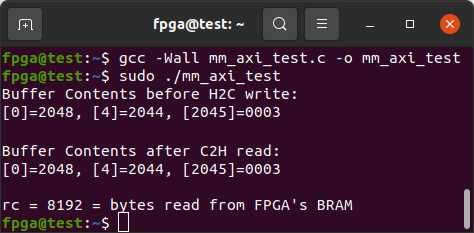


### M_AXI_LITE

The **M_AXI_LITE** interface is an abridged variation of MM-AXI Protocol that fixes transactions to a single 32-bit value. It is useful for single word access to register-like blocks, typically control and status registers, performed via direct device memory I/O.


The [BRAM Controller Block](https://docs.xilinx.com/v/u/en-US/pg078-axi-bram-ctrl) attached to the interface has an address of `0x40010000` and a size of 8KB (smallest that will consistently work). You can increase the *Size*/*Range* up to the maximum that Vivado will successfully implement based on your FPGA's resources.

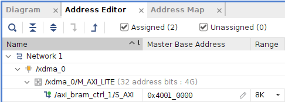

The XDMA Block in the example is [set up with a PCIe to AXI Translation offset](#add-xdma-block) of `0x40000000` which must be subtracted from the intended AXI address. It is safest to leave the offset at `0` in your designs but useful to be aware of if you are working with other's projects.

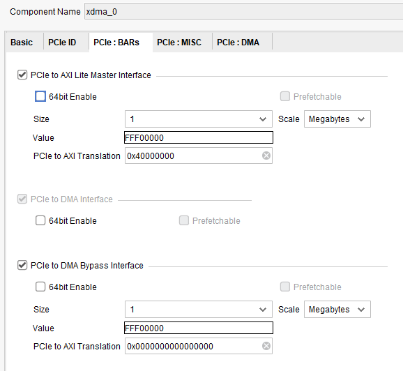

The following is some minimal C code without error checking. Note that each `M_AXI_LITE` transaction consists of a 32-bit=4-byte data word since it is designed for low throughput control and status data. `/dev/xdma0_user` is opened Read-Write ([`O_RDWR`](https://manpages.ubuntu.com/manpages/trusty/en/man2/open.2.html)) as it is supports bidirectional access.
```C
// Open M_AXI_LITE Device as Read-Write
int xdma_userfd = open("/dev/xdma0_user", O_RDWR);

#define XDMA_PCIe_to_AXI_Translation_Offset 0x40000000
uint64_t address = 0x40010000 - XDMA_PCIe_to_AXI_Translation_Offset;
uint32_t data_word = 0xAA55A55A;
ssize_t rc;

rc = pwrite(xdma_userfd, &data_word, sizeof(data_word), address);

data_word = 0;

rc = pread(xdma_userfd, &data_word, sizeof(data_word), address);

printf("AXILite Address 0x%08lX after offset has data: 0x%08X",
	address, data_word);
printf(", rc = %ld\n", rc);


close(xdma_userfd);
```

[`mm_axilite_test.c`](mm_axilite_test.c) contains the above in a full C program.

```
gcc -Wall mm_axilite_test.c -o mm_axilite_test
sudo ./mm_axilite_test
```

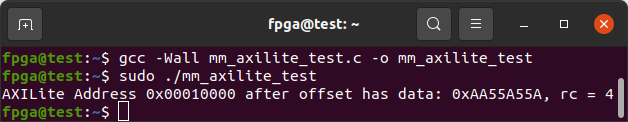

### M_AXI_BYPASS

The **M_AXI_BYPASS** interface could be [useful for small transfers that require low and stable latency](https://github.com/Prandr/dma_ip_drivers/blob/reworked_xdma_main/XDMA/linux-kernel/docs/bypass_bar.md), since it utilises direct device memory I/O instead of DMA and thus avoids the overhead of the latter in setting up a transfer.
On the other hand, it is faster and more efficient than AXI-Lite as it allows to transmit unlimited amount data in a single call and in 64-bit pieces if executed on a 64-bit host.

The example code is superficially similar to M\_AXI above, but demostrates usage of `lseek` and opens  `/dev/xdma0_bypass` in  Read-Write `O_RDWR` mode as it is supports bidirectional access.
The PCIe to AXI Translation offset is set to 0, therefore the address directly corresponds to the address in the device.
```C
#define DATA_BYTES	8192
#define DATA_WORDS	(DATA_BYTES/sizeof(uint32_t))

uint32_t write_buffer[DATA_WORDS]={};
uint32_t read_buffer[DATA_WORDS]={};
const uint64_t address = 0x00000000;
int xdma_bypass_fd = 0;
ssize_t rc;

// Fill the write_buffer with data
for (int i = 0; i < DATA_WORDS; i++) { write_buffer[i] = (DATA_WORDS - i); }

printf("Buffer Contents before H2C write: \n");
printf("[0]=%04d, [4]=%04d, [%ld]=%04d\n",
	(uint32_t)write_buffer[0], (uint32_t)write_buffer[4],
	(DATA_WORDS - 3), (uint32_t)write_buffer[(DATA_WORDS - 3)]);

// Open M_AXI_BYPASS as read-write
xdma_bypass_fd = open("/dev/xdma0_bypass", O_RDWR);

//set address. In this case redundant, because the address is 0 after opening anyway.
lseek(xdma_bypass_fd, address, SEEK_SET);

// Write the full write_buffer to the FPGA design's BRAM
rc = write(xdma_bypass_fd, write_buffer, DATA_BYTES);


//restore address back to 0.
lseek(xdma_bypass_fd, address, SEEK_SET);

// Read the full read_buffer from the FPGA design's BRAM
rc = read(xdma_bypass_fd, read_buffer, DATA_BYTES);

printf("\nBuffer Contents after C2H read: \n");
printf("[0]=%04d, [4]=%04d, [%ld]=%04d\n",
	(uint32_t)read_buffer[0], (uint32_t)read_buffer[4],
	(DATA_WORDS - 3), (uint32_t)read_buffer[(DATA_WORDS - 3)]);

printf("\nrc = %ld = bytes read from FPGA's BRAM\n", rc);


close(xdma_bypass_fd);
```

[`mm_axi_bypass_test.c`](mm_axi_bypass_test.c) contains the above in a full C program.

```
gcc -Wall mm_axi_bypass_test.c -o mm_axi_bypass_test
sudo ./mm_axi_bypass_test
```

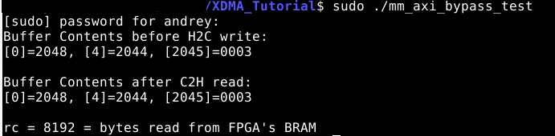

## `ioctl` Operations on DMA Devices
The driver extends functionality of standard file operations with `ioctl` operations.

```C
#include <sys/ioctl.h>

int ioctl(int fd, unsigned long op, ...)
```
The operation codes and data structures are defined in `xdma_ioctl.h` that is installed to `/usr/local/include` by the `make install` and therefore visible system-wide. 

### DMA Transfers with `ioctl`
The most important operation `XDMA_IOCTL_SUBMIT_TRANSFER` provides an additional method to submit DMA transfer requests that could be used for all transfers, but becomes indispensable for transfers above ~2 GB limit for file operations in Linux kernel. A pointer to `struct xdma_transfer_request` is used to pass the transfer parameters to the driver. After the operation the `length` field holds the amount of data that is known to have been transferred.

```C
#include <xdma_ioctl.h>
enum xdma_transfer_mode
{XDMA_H2C, XDMA_C2H };
/*Structure for submitting the transfer request
(XDMA_IOCTL_SUBMIT_TRANSFER ioctl operation) */
struct xdma_transfer_request {
/*Pointer to buffer in user space*/
	const char *buf;
/*Size of the buffer == Length of the transfer
After the transfer it holds actual amount of 
transmitted data*/ 
	size_t length;
/*AXI address from which or to which transfer the data.
Ignored for AXI Stream interface*/
	off_t axi_address;
/*Direction of the transfer*/
	enum xdma_transfer_mode mode;
};
```
The procedure is almost dentical for both AXI-MM and AXI-Stream variants, except for `axi_address` field, that doesn't not need to be filled for the latter. For demonstration the example from "M\_AXI" section is converted to this method.

```C
#define DATA_BYTES	8192
#define DATA_WORDS	(DATA_BYTES/sizeof(uint32_t))

uint32_t write_buffer[DATA_WORDS]={};
uint32_t read_buffer[DATA_WORDS]={};
uint64_t address = 0xC0000000;
int xdma_h2cfd = 0;
int xdma_c2hfd = 0;
ssize_t rc;
//fill the transfer request structure for uploading the data
struct xdma_transfer_request transfer_request=
{
	.buf=(char *) write_buffer,//cast is needed
	.length=DATA_BYTES,
	.axi_address=address,
	.mode=XDMA_H2C
};

// Fill the write_buffer with data
for (int i = 0; i < DATA_WORDS; i++) { write_buffer[i] = (DATA_WORDS - i); }

printf("Buffer Contents before H2C write: \n");
printf("[0]=%04d, [4]=%04d, [%ld]=%04d\n",
	(uint32_t)write_buffer[0], (uint32_t)write_buffer[4],
	(DATA_WORDS - 3), (uint32_t)write_buffer[(DATA_WORDS - 3)]);

// Open M_AXI H2C Host-to-Card Device as Write-Only
xdma_h2cfd = open("/dev/xdma0_h2c_0", O_WRONLY);

// Write the full write_buffer to the FPGA design's BRAM
rc = ioctl(xdma_h2cfd, XDMA_IOCTL_SUBMIT_TRANSFER, &transfer_request);
printf("ioctl returned %zd, errno %i\n", rc, errno);
//Reuse the structure for downloading data for simplicity. 
//Probably better use a separate variable in real life applications
transfer_request.buf=(char *) read_buffer;//cast is neede
transfer_request.length=DATA_BYTES;//unchanged, redundant
transfer_request.axi_address=address;//unchanged, redundant
transfer_request.mode=XDMA_C2H;

// Open M_AXI C2H Card-to-Host Device as Read-Only
xdma_c2hfd = open("/dev/xdma0_c2h_0", O_RDONLY);

// Read the full read_buffer from the FPGA design's BRAM
rc = ioctl(xdma_c2hfd, XDMA_IOCTL_SUBMIT_TRANSFER, &transfer_request);

printf("\nBuffer Contents after C2H read: \n");
printf("[0]=%04d, [4]=%04d, [%ld]=%04d\n",
	(uint32_t)read_buffer[0], (uint32_t)read_buffer[4],
	(DATA_WORDS - 3), (uint32_t)read_buffer[(DATA_WORDS - 3)]);

printf("\nrc = %ld = bytes read from FPGA's BRAM\n", transfer_request.length);


close(xdma_h2cfd);
close(xdma_c2hfd);
exit(EXIT_SUCCESS);
```

[`mm_axi_over_ioctl_test.c`](mm_axi_over_ioctl_test.c) contains the above in a full C program.

```
gcc -Wall mm_axi_over_ioctl_test.c -o mm_axi_over_ioctl_test
sudo ./mm_axi_over_ioctl_test
```
### Testing Performance
The driver supports XDMA's intrinsic performance test feature with `XDMA_IOCTL_PERF_TEST` operation, that takes a pointer to `xdma_performance_ioctl` structure.

```C
struct xdma_performance_ioctl {
/*Length of the transfer for the performance test.
Typically up to 64 MB and must be multiple of datapath width.*/
	uint32_t transfer_size;
	/*for MM AXI: AXI address to or from which  the transfer
	willl be directed. Ignored for AXI-Stream interface.
	Must be capable to produce or sink transfer_size amount of
	data*/
	off_t axi_address;
	/* measurement */
	uint64_t clock_cycle_count;
	uint64_t data_cycle_count;
};
```

The test can be used to measure raw data rate of the DMA transfers, that is significantly more accurate than common call-to-return method, that includes setup and cleanup stages of a transfer. However, it is still not 100% exact, because it counts in loading of descriptors phase.

The `transfer_size` field allows to set the size of data sample used for the test. The larger the sample, the closer the measurement would be to the exact value. However, the logic on the FPGA must be able to consume (for H2C channel) or produce (for C2H channel) that amount of data.

The result of the measurement is returned in the `data_cycle_count` and `clock_cycle_count` fields. Their ratio gives approximate transfer efficiency. The data rate can be calculated out of them as:

```
data_cycle_count / clock_cycle_count * AXI clock frequency * datapath width
```

Following  function showcases example usage:

```C
#include <fcntl.h>
#include <unistd.h>
#include <stdio.h>
#include <stdint.h>
#include <string.h>
#include <errno.h>
#include <stdlib.h>
#include <time.h>
#include <stdbool.h>
#include <xdma_ioctl.h>
#include <sys/ioctl.h>

#define AXI_CLOCK_FREQ 125000000
#define DATAPATH_WIDTH 8

/*oflag: O_RDONLY or O_WRONLY, depending on the direction of the DMA channel.
size: size of the test sample*/
void test_xdma_ioctl_perf(const char *device_file_name, int oflag, uint32_t size)
{
    int rv;
    struct xdma_performance_ioctl perf_res={
	.transfer_size=size};
    int fd=open(device_file_name, oflag);
    if(fd< 0)
    {
	fprintf(stderr, "Failed to open %s\n", device_file_name);
	return;
    }
    rv=ioctl(fd, XDMA_IOCTL_PERF_TEST, &perf_res);
    if(rv<0)
    {
	fprintf(stderr, "Performance test on %s has failed\n", device_file_name);
	fprintf(stderr, ": %s (%u)\n", strerror(errno), errno);
    }
    else
    {
	double ratio=((double) perf_res.data_cycle_count)/((double) perf_res.clock_cycle_count);
	printf("Perfomance of channel %s: data was transferred on %u cycles out of %u (%f \%), measured data rate: %f B/s \n",
		device_file_name, perf_res.data_cycle_count, perf_res.clock_cycle_count, ratio*100.0, ratio*AXI_CLOCK_FREQ*DATAPATH_WIDTH);
    }
    

    close(fd);

}
```

### Other Operations

   * `XDMA_IOCTL_ADDRMODE_SET` allows to turn on (`true`) or off (`false`) the fixed address mode aka non-incremental mode for MM DMA devices. Requires a *pointer to* `bool`.
   * `XDMA_IOCTL_ADDRMODE_GET` quires, if the fixed address mode aka non-incremental mode is currently active. Takes a *pointer to* `bool`.
   * `XDMA_IOCTL_ALIGN_GET` returns value, to which the user data buffer has to be aligned, as an `int`, *a pointer to which* must be passed to `ioctl`.


## Creating an AXI4-Stream XDMA Block Diagram Design

This procedure will recreate the design for the AXI-Stream example.

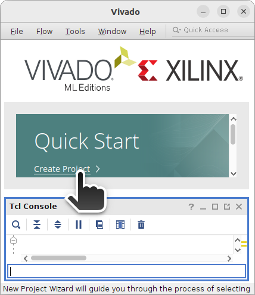

It should be an RTL Project with no source files to start.


Choose the FPGA to target:

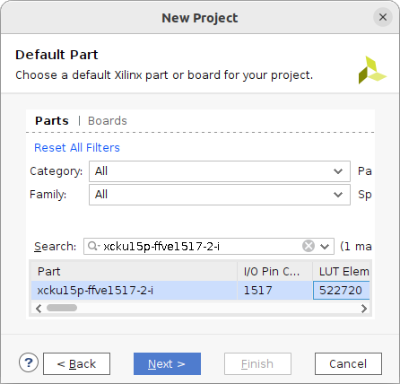

Create a Block Design:

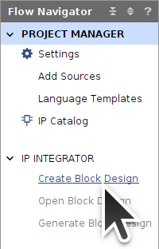

Add IP Blocks:

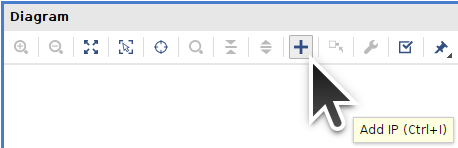


#### Add XDMA Stream Block

Add an XDMA Block:

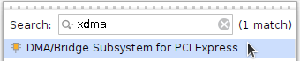

Run Block Automation:

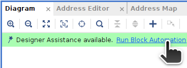

Choose PCIe Lane Width and Link Speed compatible with your target board. Select **AXI Stream** as the *DMA Interface* and add an AXI Lite interface:

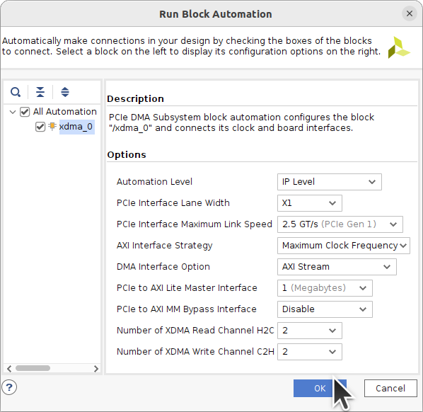

Block Automation should add the external PCIe TX+RX, Reset, and Clock signals:

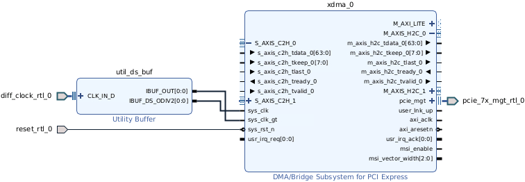

Double-click the `xdma_0` Block to open it up for customization. Notice *AXI Data Width* is 64-Bit.

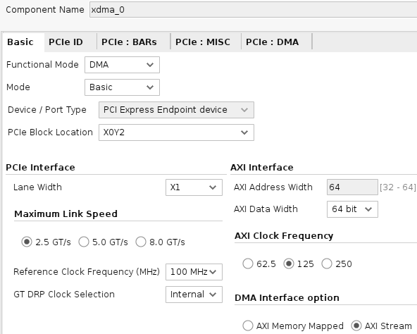

The *PCIe Block Location* chosen should be the closest PCIE Block adjacent to the transceiver Quad that the PCIe lanes are connected to on your FPGA board. Refer to the [Device Packaging and Pinouts Product Specification User Guide](https://docs.xilinx.com/r/en-US/ug575-ultrascale-pkg-pinout/XCKU15P-and-XQKU15P-Bank-Diagrams).


Make sure that device ID is set to 8034 and set the PCIe ID *Base Class* to **Memory Controller** as the *Sub Class* to **Other memory controller**..

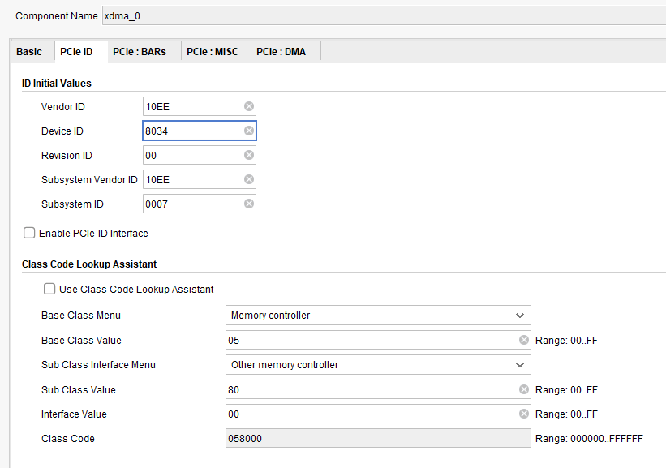

A *PCIe to AXI Translation* offset is useful to make sure the *Size* of your AXI Lite BAR overlaps the address space of all peripheral blocks. This is useful when a soft-core processor has its [peripherals in a sequence at some address range](https://en.wikipedia.org/wiki/Memory-mapped_I/O_and_port-mapped_I/O) like `0x7001000`, `0x7002000`, `0x7003000`, etc. Leave it at `0` unless you have a reason to change it. It is set to a non-zero value in this example for illustrative purposes so that readers are aware of it when communicating with other's projects. The offset should be `0` or [larger than *Size*](https://support.xilinx.com/s/question/0D52E00006hpbPJSAY/pcie-to-axi-translation-setting-for-dma-bypass-interface-not-being-applied?language=en_US): `0x40000000 > 1MB==1048576==0x100000`. This offset becomes the lowest accessible memory address. All `M_AXI_LITE` IP Block addresses must be greater than the offset.

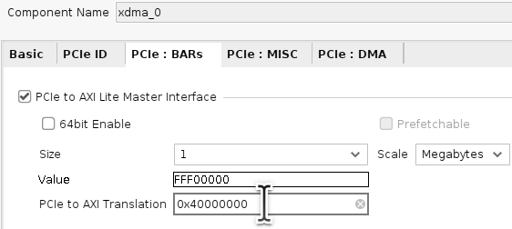

Each channel has an AXI-Stream circuit: `S_AXIS_C2H_?` or `M_AXIS_H2C_?`. The XDMA Driver will create a `/dev/xdma0_c2h_?` or `/dev/xdma0_h2c_?` file for each channel. 


Click on the `+` next to the `S_AXIS_C2H_0` and `M_AXIS_H2C_0` channels to expand them. Note the `tdata` width. It is 64-Bits for this demo. Connect `S_AXIS_C2H_1` and `M_AXIS_H2C_1` to each other for loopback testing.


#### AXI4-Stream Broadcaster Block

Add an [AXI4-Stream Broadcaster](https://docs.xilinx.com/r/en-US/pg085-axi4stream-infrastructure/AXI4-Stream-Broadcaster?tocId=lTRZ8UtIrjz6JIc8NcwYXg) block which will take a 64-Bit=8-Byte input stream and output two 32-Bit=4-Byte streams. Connect its `S_AXIS` input to `M_AXIS_H2C_0` of the XDMA Block. Its *aclk* should connect to the XDMA block's *axi_aclk*. Its *aresetn* should connect to the XDMA block's *axi_aresetn*.

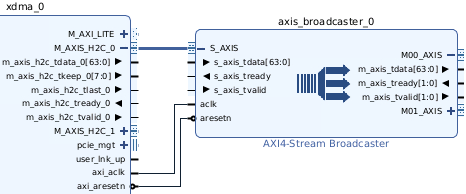

Set it up to convert an 8-Byte=64-Bit input stream into two 4-Byte=32-Bit output streams:

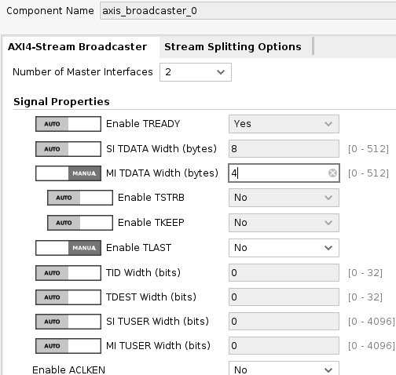

In the *Stream Splitting Options* tab, one of the output streams is set up to be the lower 32-bits of the input and the second stream is the upper 32-bits.

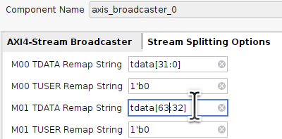


#### Floating-Point Block

Add a [Floating-Point](https://docs.xilinx.com/v/u/en-US/pg060-floating-point) block to the stream as an example of something useful. Connect its `S_AXIS_?` inputs to the `M??_AXIS` outputs of the *AXI4-Stream Broadcaster*. Its *aclk* and *aresetn* signals should connect to *axi_aclk* and *axi_aresetn* of the XDMA Block.

Each pair of 32-bit=4-byte single precision floating-point values in the 64-Bit=8-Byte Host-to-Card (H2C) stream gets multiplied to produce a floating-point value in the 64-Bit=8-Byte Card-to-Host (C2H) stream. Half as many reads from C2H are necessary as writes to H2C.

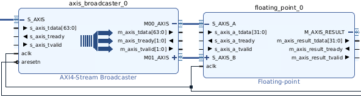

The floating-point block is set up to multiply the inputs.


Full DSP usage is set to maximize throughput.

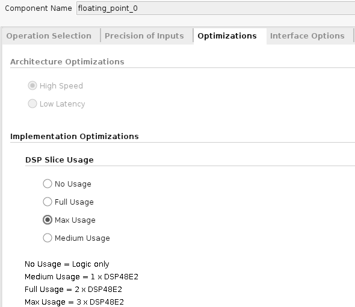

The interface is set up as *Blocking* so that the AXI4-Stream interfaces include `tready` signals like the rest of the Stream blocks.


#### Data Width Converter

Add an [AXI4-Stream Data Width Converter](https://docs.xilinx.com/r/en-US/pg085-axi4stream-infrastructure/AXI4-Stream-Data-Width-Converter?tocId=XeJGiRyJ7jaFrWoPmP_A0w). Connect its `S_AXIS` input to the 32-Bit=4-Byte `M_AXIS_RESULT` output of the Floating-Point block. Connect its output `M_AXIS` port to the `S_AXIS_C2H_0` port of the XDMA Block. Its *aclk* and *aresetn* signals should connect to *axi_aclk* and *axi_aresetn* of the XDMA Block.

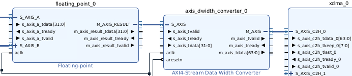

Set it up to convert its 32-Bit=4-Byte input into a 64-Bit=8-Byte output compatible with the C2H port of the XDMA Block. It will use a FIFO to convert pairs of 32-Bit=4-Byte inputs into 64-Bit=8-Byte outputs.

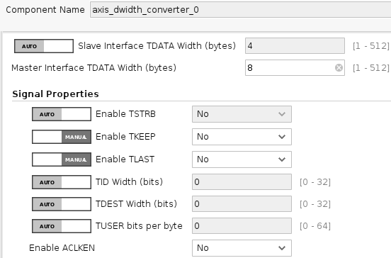


#### M_AXI_LITE Blocks

##### Add M_AXI_LITE SmartConnect Block to XDMA Stream

Add AXI SmartConnect:

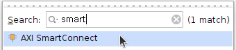

For this project only one of each interface is required.

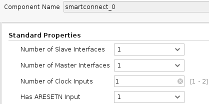

Connect its *aclk* input to the `xdma_0` block's *axi_aclk* and its *aresetn* input to *axi_aresetn*. Connect the `S00_AXI` port of the SmartConnect block to the `M_AXI_LITE` port of the XDMA Block.

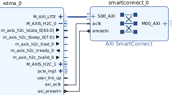


##### Add BRAM Controller Blocks to XDMA Stream

Add an AXI BRAM Controller:

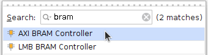

Connect its `S_AXI` port to a `M??_AXI` port of the SmartConnect block.

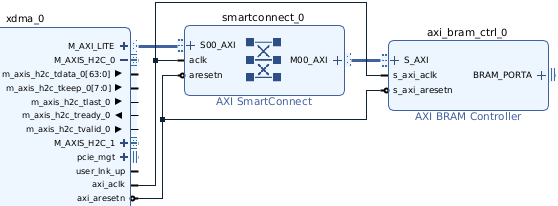

Double-click the `axi_bram_ctrl_0` block connected to the PCIe **M_AXI_LITE** interface and choose *AXI4LITE* as the AXI Protocol which forces the Data Width to 32-Bit. The Number of BRAM interfaces is set to 1 to simplify the design.

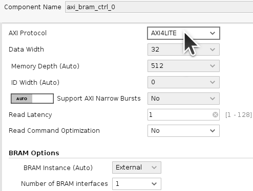

Run Block Automation:


Choose to generate a new Block Memory (*New Blk_Mem_Gen*) for the BRAM Controller:

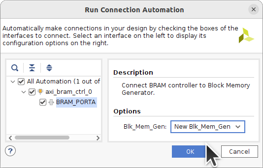

A [Block Memory Generator](https://docs.xilinx.com/v/u/en-US/pg058-blk-mem-gen) should appear for each BRAM Controller.

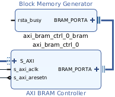

Click on the Block to Select it:

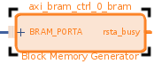

Press CTRL-R to rotate the block:

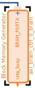


##### M_AXI_LITE BRAM Circuit Diagram

Finished BRAM Block connected to **M_AXI_LITE**. Adding other low-throughput register-like blocks such as [GPIO](https://docs.xilinx.com/v/u/en-US/pg144-axi-gpio) is similarly accomplished by adding more **M??_AXI** ports to the SmartConnect Block.

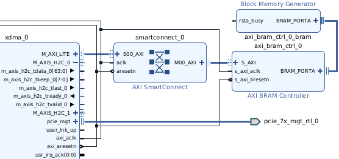


#### Stream Block Diagram

The resulting complete XDMA Stream Block Diagram:


[Expanded view](img/xdma_stream_Block_Diagram.png).


#### M_AXI_LITE Addresses

Open the *Address Editor* tab, right-click and select *Assign All*:

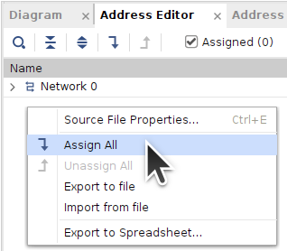

Edit the AXI Block addresses as required. The *Range* is the size that Vivado will implement for each block and this is where you set it. If the value is too large for your target FPGA then Implementation will fail. Larger sizes may have timing issues as more FPGA resources that are further apart are needed.

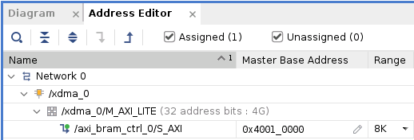


#### XDMA Stream Constraints

Right-click in the *Sources* window to *Add Sources*:


Add or Create a Constraints File:

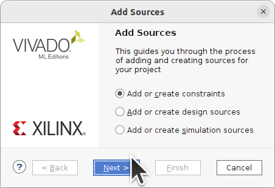

Create File:


Name the Constraints File:


Double-click the `constraints.xdc` file to edit it.

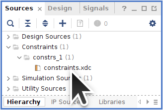

You will need to edit the PCIe TX/RX, Reset, and Clock signals to your board's pins. The TX/RX and Clock signals are differential but only the positive terminals need to be set as that restricts the other terminal. `CONFIG_MODE` and other `BITSTREAM` settings may also need to be set for your target board.
```
set_property PACKAGE_PIN AH36 [get_ports {pcie_7x_mgt_rtl_0_rxp[0]}]

set_property PACKAGE_PIN AB27 [get_ports {diff_clock_rtl_0_clk_p[0]}]
create_clock -name sys_clk -period 10.000 [get_ports diff_clock_rtl_0_clk_p]

set_property PACKAGE_PIN F2 [get_ports reset_rtl_0]
set_property IOSTANDARD LVCMOS33 [get_ports reset_rtl_0]
set_false_path -from [get_ports reset_rtl_0]

set_property CONFIG_MODE SPIx8 [current_design]
set_property BITSTREAM.GENERAL.COMPRESS TRUE [current_design]
# ... rest of BITSTREAM settings ...
```


#### XDMA Stream HDL Wrapper

Right-click on your Block Diagram (`.bd`) design file and choose *Create HDL Wrapper*:


Let Vivado Manage the HDL Wrapper file:


#### Generate XDMA Stream Bitstream

The source files should now be ready for Bitsream generation:

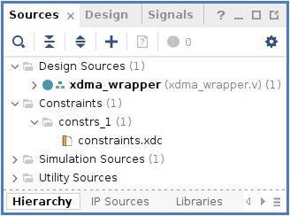

Generate the Bitstream:


Synthesis and Implementation should take about 10 minutes:


Generate a Memory Configuration File and follow your board's instructions for programming.

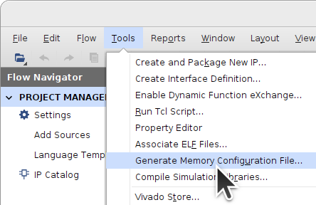


## Creating a Memory-Mapped XDMA Block Diagram Design

This procedure will recreate for the Memory-mapped examples.

Start Vivado and choose *Create Project*:


It should be an RTL Project with no source files to start.


Choose the FPGA to target:


Create a Block Design:


Add IP Blocks:


#### Add XDMA Block

Add an XDMA Block:


Run Block Automation:


Choose PCIe Lane Width and Link Speed compatible with your target board. Select **AXI Memory Mapped** for the *DMA interface* and add an AXI Lite interface.

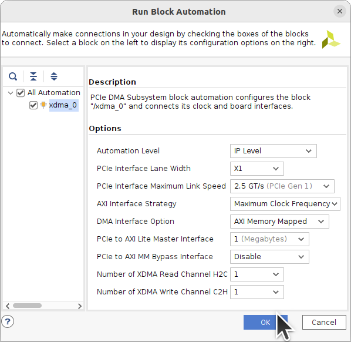

Block Automation should add the external PCIe TX+RX, Reset, and Clock signals:


Double-click the `xdma_0` Block to open it up for customization. Notice *AXI Data Width* is 64-Bit.

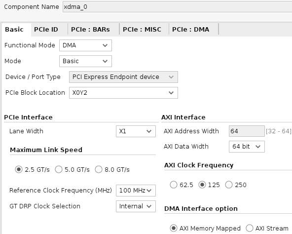

The *PCIe Block Location* chosen should be the closest PCIE Block adjacent to the transceiver Quad that the PCIe lanes are connected to on your FPGA board. Refer to the [Device Packaging and Pinouts Product Specification User Guide](https://docs.xilinx.com/r/en-US/ug575-ultrascale-pkg-pinout/XCKU15P-and-XQKU15P-Bank-Diagrams).


Make sure that device ID is set to 8034 and set the PCIe ID *Base Class* to **Memory Controller** as the *Sub Class* to **Other memory controller**.


Choose size of the BAR such that it would be greater than the sum of sizes of address ranges of your blocks.

A *PCIe to AXI Translation* offset is useful to make sure the *Size* of your AXI Lite address space overlaps the address ranges of all peripheral blocks. This is useful when a soft-core processor has its [peripherals in a sequence at some address range](https://en.wikipedia.org/wiki/Memory-mapped_I/O_and_port-mapped_I/O) like `0x7001000`, `0x7002000`, `0x7003000`, etc. Leave it at `0` unless you have a reason to change it. It is set to a non-zero value in this example for illustrative purposes so that readers are aware of it when communicating with other's projects. The offset should be `0` or [larger than *Size*](https://support.xilinx.com/s/question/0D52E00006hpbPJSAY/pcie-to-axi-translation-setting-for-dma-bypass-interface-not-being-applied?language=en_US): `0x40000000 > 1MB==1048576==0x100000`. This offset becomes the lowest accessible memory address. All `M_AXI_LITE` IP Block addresses must be greater than the offset.

The same is applicable to the DMA Bypass interface. The AXI Translation is set to 0 for it.


The XDMA Driver will create a `/dev/xdma0_?` file for each channel. Multiple channels allow multiple programs or threads to access the AXI blocks in your design.


#### Add SmartConnect Blocks

Add AXI SmartConnect:


For this project only one of each interface is required.


All interfaces shall have their own SmartConnect block for the purpose of demonstration. Although they all could share a single SmartConnect, it is a good practice to separate (Full) AXI and AXI-Lite into dedicated networks to save resources. Connect their *aclk* input to the `xdma_0` block's *axi_aclk* and their *aresetn* input to *axi_aresetn*. Connect the `S00_AXI` port of one block to `M_AXI` of the XDMA Block and similarly for `M_AXI_LITE`and `M_AXI_BYPASS`.

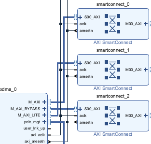


#### Add BRAM Controller Blocks

Add AXI BRAM Controller:


Add a BRAM Controller for each SmartConnect interface and connect their `S_AXI` ports to the corresponding `M00_AXI` port of the SmartConnect blocks.

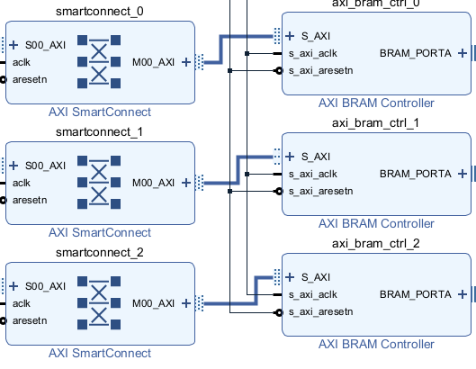

Double-click the `axi_bram_ctrl_0` block connected to the PCIe **M_AXI** interface and choose a Data Width that matches the *AXI Data Width* of the `xdma_0` block which is 64-Bit for this example. The Number of BRAM interfaces is set to 1 to simplify the design. The same action should be performed for **M_AXI_BYPASS**.


Double-click the `axi_bram_ctrl_1` block connected to the PCIe **M_AXI_LITE** interface and choose *AXI4LITE* as the AXI Protocol which forces the Data Width to 32-Bit. The Number of BRAM interfaces is set to 1 to simplify the design.

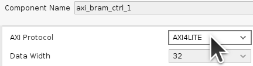

Run Block Automation:


Choose to generate a new Block Memory for each (*New Blk_Mem_Gen*):

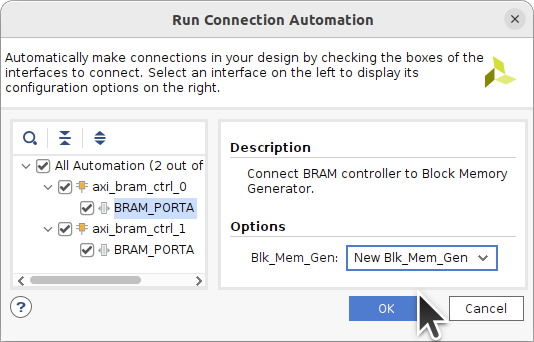

A [Block Memory Generator](https://docs.xilinx.com/v/u/en-US/pg058-blk-mem-gen) should appear for each BRAM Controller.

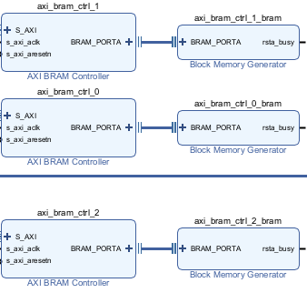

Click on the Block to Select it:


Press CTRL-R to rotate the block:


#### Memory-Mapped Block Diagram

The Block Diagram is now complete:


#### Address Editor

Open the *Address Editor* tab, right-click and select *Assign All*:


Edit the AXI Block addresses as required. The *Range* is the size that Vivado will implement for each block and this is where you set it. Even though each Network can have overlapping addresses, avoid this as it can lead to confusion.  The address range of each block must fall within (PCIe to AXI Translation offset + size of the BAR).


#### Constraints

Right-click in the *Sources* window to *Add Sources*:


Add or Create a Constraints File:


Create File:


Name the Constraints File:


Double-click the `constraints.xdc` file to edit it.


You will need to edit the PCIe TX/RX, Reset, and Clock signals to your board's pins. The TX/RX and Clock signals are differential but only the positive terminals need to be set as that restricts the other terminal. `CONFIG_MODE` and other `BITSTREAM` settings may also need to be set for your target board.
```
set_property PACKAGE_PIN AH36 [get_ports {pcie_7x_mgt_rtl_0_rxp[0]}]

set_property PACKAGE_PIN AB27 [get_ports {diff_clock_rtl_0_clk_p[0]}]
create_clock -name sys_clk -period 10.000 [get_ports diff_clock_rtl_0_clk_p]

set_property PACKAGE_PIN F2 [get_ports reset_rtl_0]
set_property IOSTANDARD LVCMOS33 [get_ports reset_rtl_0]
set_false_path -from [get_ports reset_rtl_0]

set_property CONFIG_MODE SPIx8 [current_design]
set_property BITSTREAM.GENERAL.COMPRESS TRUE [current_design]
# ... rest of BITSTREAM settings ...
```


#### HDL Wrapper

Right-click on your Block Diagram (`.bd`) design file and choose *Create HDL Wrapper*:


Let Vivado Manage the HDL Wrapper file:


#### Generate Bitstream

The source files should now be ready for Bitsream generation:


Generate the Bitstream:


Synthesis and Implementation should take about 10 minutes:


Generate a Memory Configuration File and follow your board's instructions for programming.


## Porting the Design to Another FPGA

If your board and target FPGA are different than those in the design creation guides, the design can be re-targeted.

Under *Tools->Settings*, change the **Project Device**.


The project's IP will now be out-of-date. Run *Report IP Status*.


Select all the IP check boxes and run *Upgrade Selected*.


The IP should upgrade successfully if it is not too different an FPGA.


Rerun *IP Status* to confirm everything has upgraded.


[Edit the constraints file](#constraints) to target your FPGA board.


Generate the Bitstream:


## Install XDMA Driver from dma_ip_drivers

Download and extract the November 10, 2023, commit a93d4a4 version of Xilinx's [DMA IP Drivers](https://github.com/Xilinx/dma_ip_drivers/tree/a93d4a4870e41d152b33aebb3f869eefb11aa691).
```Shell
cd ~
wget https://codeload.github.com/Xilinx/dma_ip_drivers/zip/a93d4a4870e41d152b33aebb3f869eefb11aa691 -O dma_ip_drivers-a93d4a4.zip
unzip dma_ip_drivers-a93d4a4.zip
mv dma_ip_drivers-a93d4a4870e41d152b33aebb3f869eefb11aa691 dma_ip_drivers

cd dma_ip_drivers/XDMA/linux-kernel/xdma/
make DEBUG=1
sudo make install

sudo depmod -a
sudo ldconfig

cd ~/dma_ip_drivers/XDMA/linux-kernel/tools
make

sudo reboot
```


## Useful Links

- [innova2_xdma_demo](https://github.com/mwrnd/innova2_xdma_demo) has notes on communicating with peripheral blocks such as GPIO and bandwidth testing of memory blocks using [dd](https://manpages.ubuntu.com/manpages/focal/en/man1/dd.1.html).
- [Xilinx DMA PCIe Tutorial](https://www.linkedin.com/pulse/xilinx-dma-pcie-tutorial-part-1-roy-messinger) by Roy Messinger on LinkedIn goes into the theory behind PCIe DMA and how XDMA block settings are related. It is based on older versions of the XDMA driver which is no longer relevant.
- [PCI Express TLP Primer](https://xillybus.com/tutorials/pci-express-tlp-pcie-primer-tutorial-guide-1) by Eli Billauer of [Xillybus](https://xillybus.com/) is a quick introduction to the PCIe Transaction Layer.
- [AXI Basics 1 - Introduction to AXI](https://support.xilinx.com/s/article/1053914)


